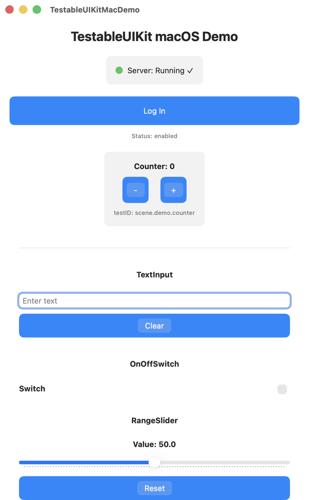

English | [日本語](README.ja.md)

[](https://github.com/ironasam43/TestableUIKit/actions/workflows/ci.yml)
[](https://swift.org)
[](https://opensource.org/licenses/MIT)

# TestableUIKit

A self-reporting UI component testing framework for iOS/macOS.

**What makes it unique:** A component self-reporting testing framework that fuses the Swift type system with AI (MCP: Model Context Protocol). UI components self-report their `testID`, state, and executable commands, enabling AI agents to directly drive and verify a running UI via MCP.

<p align="center">
  
</p>
<p align="center"><em>Every interaction above is performed by an AI agent over HTTP — no human hands involved.</em></p>

> 🚀 **New here?** For a step-by-step guide to instrumenting your own component in 5 minutes, see
> [`docs/getting-started.md`](docs/getting-started.md).
> The minimal working sample is in [`Example/`](Example/README.md), and common issues are covered in
> [`docs/troubleshooting.md`](docs/troubleshooting.md).

---

## AI-Driven Automation (MCP)

TestableUIKit ships with an [MCP (Model Context Protocol)](https://modelcontextprotocol.io/) server ([`mcp-swift/`](mcp-swift/)). AI agents such as Claude can connect from Claude Desktop / Claude Code via stdio to directly drive and verify a running UI. The framework supports two complementary approaches: **exploratory AI-driven** interaction and **deterministic declarative scenarios**.

### 1. AI Dynamic Scenarios (Exploratory)

The AI agent retrieves the current state with `ui_getState`, makes its own decision, executes a command with `ui_perform`, and confirms the result visually with `ui_screenshot` — chaining this cycle with fresh judgment each time. This is well-suited for exploring screens whose spec is still evolving or investigating unexpected behavior.

### 2. Declarative Scenarios (`ui_runScenario` — Deterministic)

Define a sequence of actions and expected values in JSON ahead of time. A single MCP call executes them in order from the first step, matching each step's `describedState` against `expect` to determine pass/fail. Because it runs deterministically without ad-hoc AI judgment, this approach is ideal for regression checks.

```json
{
  "name": "counter-flow",
  "steps": [
    { "action": "getState", "testID": "scene.demo.counter", "expect": { "count": 0 } },
    { "action": "increment", "testID": "scene.demo.counter", "expect": { "count": 1 } }
  ]
}
```

For working samples, see [`Example/scenarios/`](Example/scenarios/). For the scenario JSON format and full action catalog, see [`docs/scenario-authoring.md`](docs/scenario-authoring.md).

### MCP Tools (5 total)

| Tool | Wraps | Purpose |
|---|---|---|
| `ui_ping` | `GET /ping` | Server health check |
| `ui_getState(testID)` | `POST /perform` getState | Retrieve component state |
| `ui_perform(testID, command, params)` | `POST /perform` | Execute a command (tap / setProperty / setEnabled, etc.) |
| `ui_screenshot` | `GET /screenshot` (simctl fallback) | Capture a screenshot |
| `ui_runScenario(scenario)` | `POST /perform` forwarded for each step | Run a declarative JSON scenario and evaluate assertions |

### Starting the MCP Server

```bash
cd mcp-swift
swift run TestableUIKitMCP
```

Register it as a stdio server in your MCP client configuration (Claude Desktop / Claude Code, etc.). For protocol details, see [`docs/ipc-protocol.md`](docs/ipc-protocol.md) and [`docs/design.md`](docs/design.md) §E.

---

## 3 Instrumentation Tiers (API Tiers)

There are three API tiers at different levels of abstraction. **Start from the top** and move down only if the higher tier does not fit your needs.

| Tier | API | Best for | What you need |
|---|---|---|---|
| **Tier 2** | `TestableToggle` / `TestableTextField` / `TestableStepper` / `TestableSlider` / `TestableButton` | Standard SwiftUI controls | Just swap in the replacement view |
| **Tier 1** | `TestableComponent<State>` | Custom components (with a state value type) | Declare the state value type + `properties` / `commands` (no hand-written `perform` needed) |
| **Tier 0** | Manual `AnyTestable` conformance | Special instrumentation (lock control, cross-process, etc.) | Implement `testID` / `describedState` / `perform` yourself |

```swift
// Tier 2: Standard controls — just swap in the replacement view
TestableToggle("Notifications", isOn: $isOn, id: "settings.toggle")

// Tier 1: Custom state — just declare TestableComponent (no bridge class needed)
TestableComponent<MyToggleState>(
  id: "example.my.toggle",
  state: MyToggleState(),
  properties: ["isOn": .bool(\.isOn)],
  commands: ["toggle": { s, _ in s.isOn.toggle() }]
)
```

For a detailed guide on choosing the right tier, see the "3 API Tiers" section in [`docs/getting-started.md`](docs/getting-started.md).

---

## Documentation

| Document | Contents |
|---|---|
| [`docs/getting-started.md`](docs/getting-started.md) | Instrument your own component in 5 minutes |
| [`Example/`](Example/README.md) | Minimal sample for testing your own component |
| [`docs/ipc-protocol.md`](docs/ipc-protocol.md) | IPC protocol specification |
| [`docs/troubleshooting.md`](docs/troubleshooting.md) | Troubleshooting guide |
| [`SETUP.md`](SETUP.md) | Xcode setup instructions (including physical devices) |
| [`docs/design.md`](docs/design.md) | Design and architecture |

---

## Project Structure

```
TestableUIKit/
├── Sources/TestableUIKit/          # Swift Library (core implementation)
│   ├── JSONValue.swift             # JSON value type definitions (Codable)
│   ├── AnyTestable.swift           # @MainActor protocol
│   └── TestableServer.swift        # Registry + HTTP handler
├── Package.swift                   # Swift Package definition
├── run_test.py                     # Python test runner (Phase A/B)
├── DemoApp-iOS-template.swift      # iOS App template (SwiftUI)
├── LoginButton-iOS-template.swift  # UIButton implementation template
├── SETUP.md                        # Xcode setup instructions
└── README.md                       # This file
```

---

## Architecture

### Layer Overview

```
┌────────────────────────────────────────────────┐
│ iOS Simulator / Device (DemoApp)                │
│ ┌──────────────────────────────────────────┐  │
│ │ LoginButton (AnyTestable)                 │  │
│ │ - testID: "auth.loginButton"              │  │
│ │ - describedState: [String: JSONValue]    │  │
│ │ - perform(commandName, parameters)       │  │
│ └──────────────────────────────────────────┘  │
│ ┌──────────────────────────────────────────┐  │
│ │ TestableRegistry (shared)                │  │
│ │ - register(testable: AnyTestable)        │  │
│ │ - testable(for: testID) → AnyTestable?  │  │
│ └──────────────────────────────────────────┘  │
│ ┌──────────────────────────────────────────┐  │
│ │ TestableServer (@MainActor)              │  │
│ │ - start() async throws                   │  │
│ │ - handleRequest(...) → (status, body)   │  │
│ └──────────────────────────────────────────┘  │
└────────────────────────────────────────────────┘
          HTTP localhost:8888
          ↓        ↑
      /ping    /perform
          ↓        ↑
┌────────────────────────────────────────────────┐
│ Python Test Runner (run_test.py)               │
│ - Phase A: curl GET /ping                      │
│ - Phase B: curl POST /perform (tap command)   │
│ - Assert: response JSON contains expected state│
└────────────────────────────────────────────────┘
```

### Data Flow

1. **iOS App launches**: DemoApp calls `TestableServer.start()`
2. **Registration**: `LoginButton` registers itself with `TestableRegistry`
3. **Test execution**: The Python script sends commands via HTTP POST
4. **State retrieval**: `perform()` executes and returns `describedState` as JSON
5. **Assertion**: Python asserts against the response JSON

---

## Component Specification

### AnyTestable protocol

```swift
@MainActor
protocol AnyTestable: AnyObject {
  var testID: String { get }
  var describedState: [String: JSONValue] { get }
  func perform(commandName: String, parameters: JSONValue) async throws -> [String: JSONValue]
}
```

**Responsibilities**:
- `testID`: Unique identifier (e.g., `"auth.loginButton"`)
- `describedState`: Current logical state (JSON compatible)
- `perform()`: Execute a command and return the new state

### JSONValue enum

6-case primitive value type (JSON compatible):

```swift
enum JSONValue: Codable, Hashable, Sendable {
  case null
  case bool(Bool)
  case int(Int)
  case double(Double)
  case string(String)
  indirect case object([String: JSONValue])
}
```

Extension methods:
- `.toJSON: Any`: JSON serialization
- `.asBool`, `.asString`, `.asInt`, `.asDouble`, `.asObject`: Type casting

### LoginButton: UIButton

Example test target component:

```swift
class LoginButton: UIButton, AnyTestable {
  let testID = "auth.loginButton"
  
  var describedState: [String: JSONValue] {
    ["isEnabled": .bool(isEnabled), "title": .string(title ?? "Log In")]
  }
  
  func perform(commandName: String, parameters: JSONValue) async -> [String: JSONValue] {
    switch commandName {
    case "tap": sendActions(for: .touchUpInside); return describedState
    case "setEnabled": /* enable/disable */ return describedState
    default: throw TestableError.unknownCommand(commandName)
    }
  }
}
```

---

## Usage

### Setup (first time only)

**Prerequisites**:
- Xcode 15+
- xcodegen 2.45.3+ (install: `brew install xcodegen`)
- Python 3.8+

**Steps**:

1. **Generate the xcodeproj from project.yml**:
   ```bash
   cd TestableUIKit  # repository root
   xcodegen generate
   ```

2. **Build for Simulator**:
   ```bash
   xcodebuild \
     -project TestableUIKitDemo.xcodeproj \
     -scheme TestableUIKitDemo \
     -destination 'platform=iOS Simulator,name=iPhone 17 Pro Max' \
     build
   ```

   Or via Xcode GUI:
   ```
   Xcode > Product > Run
   ```

**Notes**:
- `TestableUIKitDemo.xcodeproj/` is excluded by `.gitignore` (auto-generated artifact)
- `project.yml` is the source of truth. If changes are needed, edit `project.yml` and re-run `xcodegen generate`

### Running Tests

```bash
# In a separate terminal
cd TestableUIKit  # repository root
python3 run_test.py
```

**Example output**:

```
[PHASE A] Network Path Verification
...
✅ [PASS] Server is reachable

[PHASE B] Logic Verification - Tap LoginButton
...
✅ [PASS] Tap command successful
   Response: {"isEnabled": true, "title": "Log In"}

All tests completed successfully!
```

### Running on a Physical Device (over LAN)

To run tests on a physical iPhone / iPad instead of the Simulator:

```bash
# Specify the device's IP address
TESTABLE_IPC_HOST=<device-IP> python3 run_test.py
```

**Example** (if the device IP is `192.168.0.181`):
```bash
TESTABLE_IPC_HOST=192.168.0.181 python3 run_test.py
```

For details (how to find the IP, firewall settings, troubleshooting), see **[SETUP.md Step 7](./SETUP.md#step-7-running-on-a-physical-device-lan)**.

---

## Technology Stack

| Layer | Technology | Version |
|---|---|---|
| **Swift Runtime** | Swift 5.9+ | iOS 15+ |
| **HTTP Framework** | Standard Library (URLSession) | — |
| **Async/Await** | Swift Concurrency | — |
| **Build Tool** | xcodegen | 2.45.3+ |
| **Package Manager** | SPM | — |
| **Test Framework** | Python 3.8+ | — |
| **HTTP Client** | curl | — |

---

## Roadmap (Backlog)

- [ ] Add Contract spec: Invariant + Transition
- [ ] Screenshot + diff analysis
- [ ] AI test generation (GPT-4 / Claude)
- [x] Physical device support (Wi-Fi LAN) ✅
- [ ] CI/CD integration (GitHub Actions)

---

## Troubleshooting

Troubleshooting has been moved to [`docs/troubleshooting.md`](docs/troubleshooting.md).
It covers server startup/connection issues, port 8888 conflicts, Registry registration misses, physical device (LAN) setup, and the Python test runner.

---

## Versioning Policy (semver)

This library follows [Semantic Versioning](https://semver.org/) for its tags.
Consumers can pin a version like:
`.package(url: "https://github.com/ironasam43/TestableUIKit", from: "0.1.0")`

### pre-1.0 Rules (current)

The public API is pre-stabilization (`0.x`) — **breaking changes are permitted at this stage**.
Under `0.x`, tags follow semver convention at this granularity:

| Change type | Bump | Example |
|---|---|---|
| Breaking changes (public API signature change/removal) | MINOR | `0.1.0` → `0.2.0` |
| Backward-compatible feature additions / bug fixes | PATCH | `0.1.0` → `0.1.1` |

> Under `0.x`, MINOR represents breaking changes and PATCH represents compatible changes (equivalent to MAJOR/MINOR after 1.0).

### When to Cut a Tag

- Cut an annotated tag at milestones where changes to the public API (exported symbols of the `TestableUIKit` library) are ready to distribute to consumers.
- Changes to internals only (tests, docs, Demo app) do not require a tag.
- Create tags with `git tag -a vX.Y.Z -m "..."` and push with `git push origin vX.Y.Z`.

### Conditions to reach 1.0 (future)

Once the public API (IPC protocol, `AnyTestable` protocol, MCP tools) is stable and the project enters a phase where breaking changes are avoided, cut `v1.0.0`.

---

## License

This project is released under the **MIT License**. See [LICENSE](LICENSE) for details.

---

## Support

For issues or questions, please report them on [GitHub Issues](https://github.com/ironasam43/TestableUIKit/issues).
